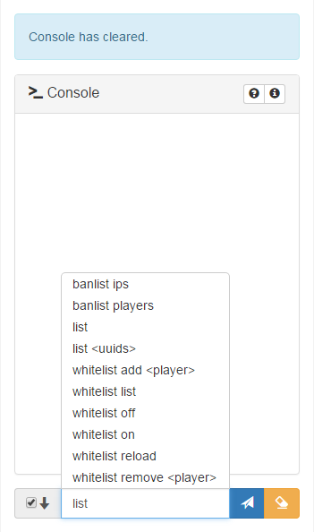

# Minecraft-RCON
Simple Minecraft RCON Web Console (using PHP, Bootstrap and Javascript) 

Inspired by [Minecraft-RCON-Console](https://github.com/ekaomk/Minecraft-RCON-Console) and using [PHP-Minecraft-Rcon](https://github.com/thedudeguy/PHP-Minecraft-Rcon).




## Configuration

1. Edit your Minecraft server `server.properties` configuration file in order to enable RCON:
```
enable-rcon=true
rcon.port=25575
rcon.password=xtMJsVtmx0XypuId7jIb
```
2. Restart your Minecraft server.
3. Download/Clone the Minecraft RCON Web Console files and edit the `config.php` file. Use the same rcon password and port than the one set in `server.properties`:
```
$rconHost = "localhost";
$rconPort = 25575;
$rconPassword = "xtMJsVtmx0XypuId7jIb";
```

## Warnings

* Provided as it is, **this console has no authentication check**, so anybody with access to this console can run any commands on the Minecraft server. Please check at least the documentations below, about how to setup some basic http authentification on your web server, in order to restrict the access to the console:
 * [For Apache 2.4 users](https://httpd.apache.org/docs/2.4/howto/auth.html)
 * [For NGinx users](https://nginx.org/en/docs/http/ngx_http_auth_basic_module.html)
* Use a strong custom random RCON password (change the default one provided here) for more security.
* Set up your firewall in order to allow only the web server to communicate with the Minecraft server through the RCON port set, for more security.


